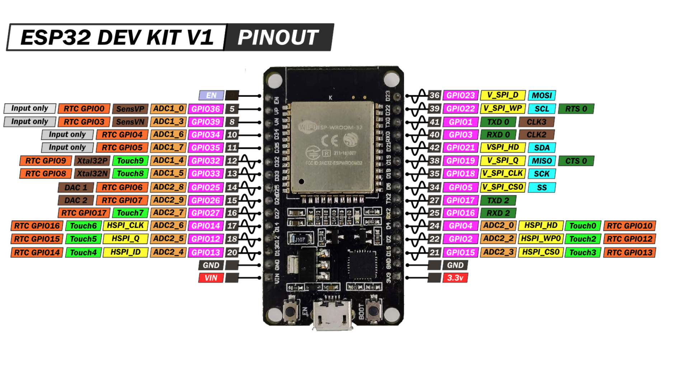
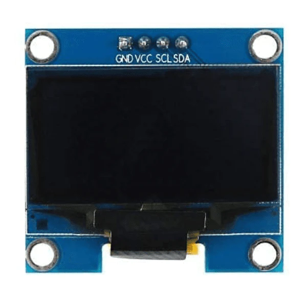

# ESP32 with Arduino IDE

Welcome to the ESP32 with Arduino IDE repository! This repository contains sample codes and programs  I used for implementing various projects on ESP32 using the Arduino IDE. If you are a beginner  developer, explore the capabilities of ESP32 and kick-start your IoT projects.

## ESP32 DevKit v1 Pinout

**Note:** Update GPIO pins according to your specific ESP32 module.

## Other Pheripheral used

## Getting Started

1. **Hardware Setup:**
   - Connect your ESP32 DevKit v1 and Pheripherals according to pinout.

2. **Arduino IDE Setup:**
   - Download and install the [Arduino IDE](https://www.arduino.cc/en/software) from the official website.
   - Open the Arduino IDE, navigate to **File > Preferences**.
   - In the Preferences window, find the field labeled "Additional Boards Manager URLs" and enter the following link:
     - `https://dl.espressif.com/dl/package_esp32_index.json`
   - Click "OK" to close the Preferences window.
   - Now, go to **Tools > Board > Boards Manager**, search for "ESP32" and install the Espressif ESP32 platform.
   - Open the tools menu to select the board. Tools > Board > Your Board (My boars is ESP32 DOIT DEVKIT v1)
   - Using Library Manager Add neccessary libraries for each projects

3. **Explore the Code:**
   - Check out the various code examples in this repo for different ESP32 projects.

4. **Customization:**
   - Modify the code according to your project requirements.
   - Update GPIO pins, Wi-Fi credentials, and other settings as needed.

## Featured Projects

- **Flappy Bird:**
  - [flappy_bird_esp32.ino](flappy_bird_esp32/flappy_bird_esp32.ino): A simple flappy bird game.

## Contributing

If you'd like to contribute to this repository by adding more examples, improving existing code, or fixing bugs, please follow the [contribution guidelines](CONTRIBUTING.md).

## SEO Keywords

ESP32 Arduino IDE, ESP32 DevKit v1, ESP32 projects, IoT programming, ESP32 examples, Arduino IDE tutorials, ESP32 GPIO programming, Internet of Things development.

**Feel free to star, fork, and explore the repository! Happy coding!**
